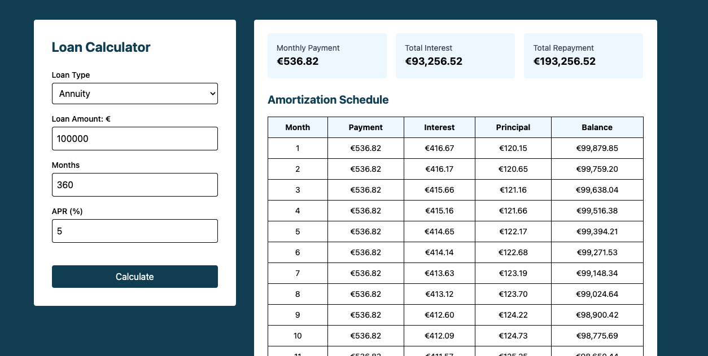

# Loan Calculator

Plain PHP loan amortization calculator supporting annuity and linear loans, with amortization schedules. Includes a lightweight frontend (Tailwind + Alpine.js) for interacting with calculations. The architecture is designed to be easily extensible, allowing additional loan types to be added in the future with minimal changes.

## How to Run Locally

### Requirements
- PHP 8.2+
- Composer

### Install Dependencies
composer install

### Run Tests
vendor/bin/phpunit

### Run the Application
php -S localhost:8000 -t public

Then open:
http://localhost:8000

---

## Architecture Overview

The backend is implemented without using a framework.
Backend is structured using OOP in plain PHP. A factory class (`LoanFactory`) is responsible for creating the correct loan type (Annuity or Linear) based on user input. Both loan types implement `LoanInterface`. Invalid loan parameters are handled through a custom `InvalidLoanException`. The calculation logic is covered by PHPUnit tests to verify correctness and edge cases. The frontend communicates with the backend via a JSON POST request to `calculation.php`, and the server returns calculated results in JSON format.

---

## Assumptions & Trade-offs

### Rounding
- Monthly values are rounded to 2 decimals.
- Final month adjusts remaining balance to exactly `0.00`.

### Validation Rules
- Principal must be greater than 0
- Loan term must be greater than 0
- APR must not be negative
- No maximum limits for principal, loan term, or APR, as they were not specified in the task requirements.

---

## Initial Estimate

Total Estimated Time: 10–12 hours

Breakdown:
1. Requirements analysis and architecture decisions – 1h  
2. Project setup (Composer, PHPUnit, structure) – 0.5h  
3. Annuity loan formula implementation – 1h  
4. Amortization schedule calculation – 2h  
5. Validation and edge case handling – 1h  
6. Unit tests – 2h  
7. Frontend implementation – 3h  
8. Documentation – 1h  

---

## Actual Time Spent

Total Actual Time: 11 hours

Breakdown:
1. Requirements analysis and architecture decisions – 1h  
2. Project setup – 0.5h  
3. Annuity loan formula implementation – 2h  
4. Amortization schedule calculation – 1h
5. Linear loan formula implementation – 0.5h  
6. Validation and edge case handling, custom exceptions – 1h  
7. Unit tests – 2h
8. Frontend implementation – 2.5h  
9. Documentation – 0.5h  

### Differences Between Estimate and Actual
- The annuity loan calculation took a bit more time than expected because I needed to review how loan amortization works and understand the difference between types of loans, find the correct formulas etc.

---

## Preview

