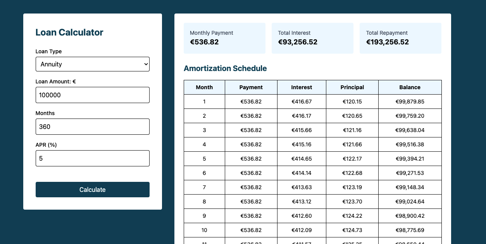

# Loan Calculator

Plain PHP loan amortization calculator supporting annuity and linear loans, with amortization schedules. Includes a lightweight frontend (Tailwind + Alpine.js) for interacting with calculations. The architecture is designed to be easily extensible, allowing additional loan types to be added in the future with minimal changes.

## How to Run Locally

### Requirements
- PHP 8.2+
- Composer

### Install Dependencies
composer install

### Run Tests
vendor/bin/phpunit

### Run the Application
php -S localhost:8000 -t public

Then open:
http://localhost:8000

---

## Architecture Overview

The backend is implemented in plain PHP without using a framework and follows OOP and SOLID principles. Database is not used.

### Core Design

- `LoanFactory` creates loan instances based on user input.
- `LoanType` (enum) ensures only supported loan types can be instantiated.
- `AnnuityLoan` and `LinearLoan` both implement `LoanInterface`.
- Calculation logic is fully separated from the frontend.
- All core logic is covered by PHPUnit tests.

### Domain Layer

The domain layer uses immutable Value Objects to ensure correctness and consistency.

- `Money` – represents monetary values internally in **integer cents** to avoid floating-point precision issues.
- `LoanTerm` – encapsulates and validates loan duration.
- `Apr` – represents the annual percentage rate.

Primitive values (float/int) are converted into Value Objects via the factory. This prevents invalid state inside the domain layer.

### Precision Strategy

All monetary calculations are performed using integer cents internally.

Values are formatted to 2 decimal places only when returned to the frontend.

This eliminates floating-point rounding errors in amortization calculations.

---

### Validation Rules
- Principal must be greater than 0
- Loan term must be greater than 0
- APR must not be negative
- No maximum limits for principal, loan term, or APR, as they were not specified in the task requirements.

---

## Preview

